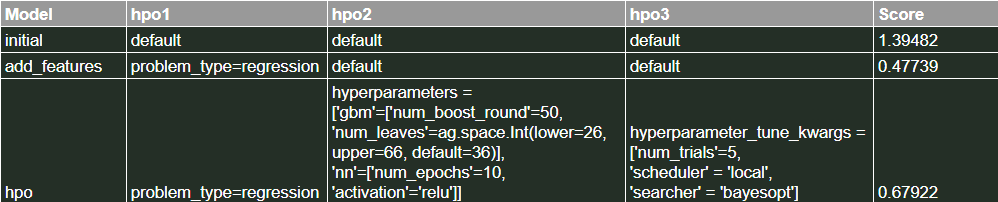
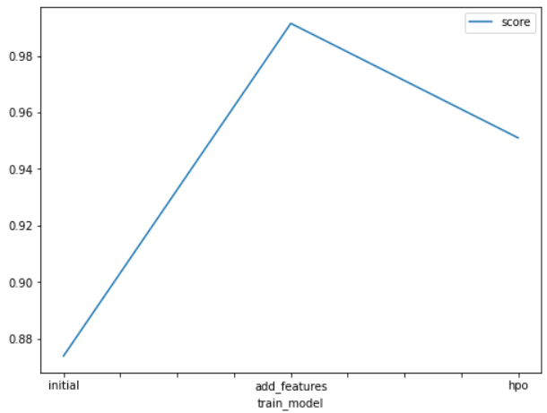
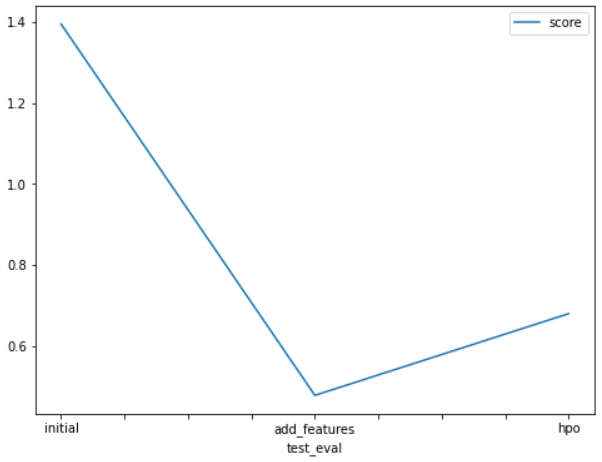

# Report: Predict Bike Sharing Demand with AutoGluon Solution
#### Sanjana Sawant

## Initial Training
### What did you realize when you tried to submit your predictions? What changes were needed to the output of the predictor to submit your results?
 
In this project, Predict Bike Sharing Demand, we were required to predict the number of bikes that could be hired. For this we trained our model using the AutoGluons TabularPredictor.

Here, count was the label for our model throughout the project. We ignored casual and registered columns as they are also not present in the test dataset. We used the root_mean_squared_error as the metric to use for evaluation and set a time limit of 10 minutes (600 seconds). Further, we used the preset: best_quality to focus on creating the best model.

However, when the model was trained for the first time, before EDA, the model missed several insights of the problem. It scored only 1.39482.The model considered date and time as a whole. Whereas, in reality the number of bikes hired at a given instance depended on the month, day and time. Furthermore, the decision to hire a bike was also influenced by the weather and the season. So, there was a eed to add more features to the dataset. Hence, we performed EDA and thereby made several changes to the training dataset.This model was then trained again with an additional feature "problem_type='regression'". This model performed way better than the first model and scored 0.47739. 

To check if the model can be optimized further, we added few more hyperparameters to it. This model scored 0.67922, which is still less than the second model. So, we can assume that second model was the best so far. 

### What was the top ranked model that performed?
The second model, one with additional features performed better and was the top ranked in my case. However, by performing more hyperparameter tuning the performance might increase.

## Exploratory data analysis and feature creation
### What did the exploratory analysis find and how did you add additional features?
Before EDA, the model missed several insights of the problem. It considered date and time as a whole. Whereas, in reality the number of bikes hired at a given instance depended on the month, day and time. Furthermore, the decision to hire a bike was also influenced by the weather and the season.
All these requirements could be met by performing Exploratory data analysis (EDA). 

So for the second model, we separated "datetime" column into "day", "hour" and "month" by parsing the date values using freeature engineering. We also changed the data type of "season" and "weather" to "categorical" type using .astype() method. This model was then trained again with one more additional feature "problem_type='regression'". 
This model performed way better than the first model and scored 0.47103.

### How much better did your model preform after adding additional features and why do you think that is?
The model performed exceeding well after adding more features. Due to Exploratory data analysis, the model was also able to understand the insights that the model missed before. It could better correlate the count of  bikes hired and their relation with the day, hour, month, season and the weather. Understanding these features helped a lot to train a better model.

## Hyper parameter tuning
### How much better did your model preform after trying different hyper parameters?
In my case, the model did not perform much better than the second model. It scored 0.67922 whereas the second model scored 0.47739. 
I tried out following hyperparameters:
For 'gbm' I have considered 'num_boost_round'=50 and 'num_leaves'=ag.space.Int(lower=26, upper=66, default=36). '
For 'nn' I have tried 'num_epochs'=10, 'activation'='relu'.
Further, I have used following  "hyperparameter_tune_kwargs", 'num_trials'=5,'scheduler'='local','searcher'='bayesopt'.
    
However, the did not quit help to increase the score.

### If you were given more time with this dataset, where do you think you would spend more time?
There are many different hyperparameters and trying out each one and their combinations will take a lot of time. But it also helps to find the best hyperparameters that give the most optimized and efficient model. Hence, I would definitely spend more time in hyperparameter tuning to get a better model. 

### Create a table with the models you ran, the hyperparameters modified, and the kaggle score.

### Create a line plot showing the top model score for the three (or more) training runs during the project.

### Create a line plot showing the top kaggle score for the three (or more) prediction submissions during the project.

## Summary
From all the models that we trained during this project, we can infer that understanding the data is very important. Exploratory data analysis is the only way to form a strong baseline mode. To get the necessary output, we need to perform EDA and add all the additional features to the training dataset. We also need to perform required hyperparameter tuning to get the desired model.
